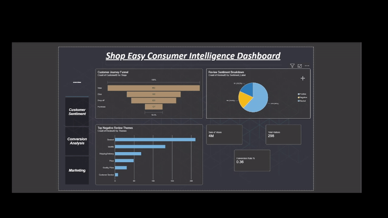

# ShopEasy Consumer Intelligence & Sentiment Analysis

This is an end-to-end data project I built to practice the full analytics pipeline — from messy raw data all the way to a working Power BI dashboard. It's based on a fictional e-commerce brand called ShopEasy, and it looks at two things: where customers drop off in the buying funnel, and what they actually think about the products they buy.

## Why I built it this way

I didn't want to just grab a clean Kaggle dataset and make a chart. I wanted to practice what real data work usually looks like — messy inputs, inconsistent formatting, and having to make judgment calls about what's actually wrong with the data versus what's just how it is. So I generated my own synthetic data and deliberately built in some common real-world problems: duplicate rows, inconsistent text casing, a couple of columns with two values crammed into one, and some intentional NULLs that actually mean something (not just missing data).

## What's in here

**Data validation (SQL)**
Before touching anything, I ran checks to actually confirm what was wrong with the data instead of guessing. Used `ROW_NUMBER()` to catch duplicate rows that a primary key was hiding, `COLLATE` to expose casing issues that a normal `SELECT DISTINCT` would've missed, and grouped counts to check whether missing values were a real pattern or a bug (turns out the NULLs only showed up on "Drop-off" journey stages, which makes sense — there's no time-spent to record if someone just left).

**Cleaning (SQL)**
Once I knew what was actually broken, I fixed it — deduped the journey table, standardized inconsistent casing, split a combined "views-clicks" string column into two real numbers, and converted text columns into proper numeric types. I kept the NULLs where they represented real behavior instead of filling them with fake values.

**Sentiment analysis (Python)**
I used VADER to score review text, but quickly found it's not great on its own for short reviews — "will buy again" scores as completely neutral in VADER even with a 5-star rating attached. So I built a hybrid score that blends VADER's text score with the actual star rating (weighted 40/60), which fixed a lot of these blind spots. I also tagged each negative review with a theme (quality, price, shipping, customer service) using simple keyword matching — nothing fancy, but it's transparent and easy to explain, which I think matters more than a black-box model for something like this.

**Dashboard (Power BI)**
Four pages: Overview, Customer Sentiment, Conversion Analysis, and Marketing, with a sidebar to navigate between them. Built a proper star-schema data model with a Calendar table connected to all three fact tables, and wrote DAX measures for things like conversion rate, total visitors, and average sentiment score.

## What I found

- About 36% of visitors who entered the funnel actually completed a purchase
- Quality complaints made up the largest share of negative reviews by far — more than price and shipping issues combined
- The hybrid sentiment score caught a bunch of reviews that VADER alone would've mislabeled as neutral

## Tools used

SQL Server, Python (VADER), Power BI

## Files

- `generate_data.py` – creates the synthetic raw datasets
- `00_create_tables.sql` – table setup
- `01_data_validation.sql` – the queries I used to find what was wrong with the data
- `02_cleaning_transformation.sql` – the actual cleaning logic
- `03_sentiment_analysis.py` – hybrid VADER + rating sentiment scoring
- `04_theme_extraction.py` – keyword-based complaint tagging
- `ShopEasy_Dashboard.pbix` – the Power BI file
- `reviews_final.csv` – reviews with sentiment scores attached

## About me

Aasa Singh Sabharwal — final year CS student, looking for Data Analyst roles.
[LinkedIn](https://linkedin.com/in/aasasingh) · [GitHub](https://github.com/Aasa2212)
